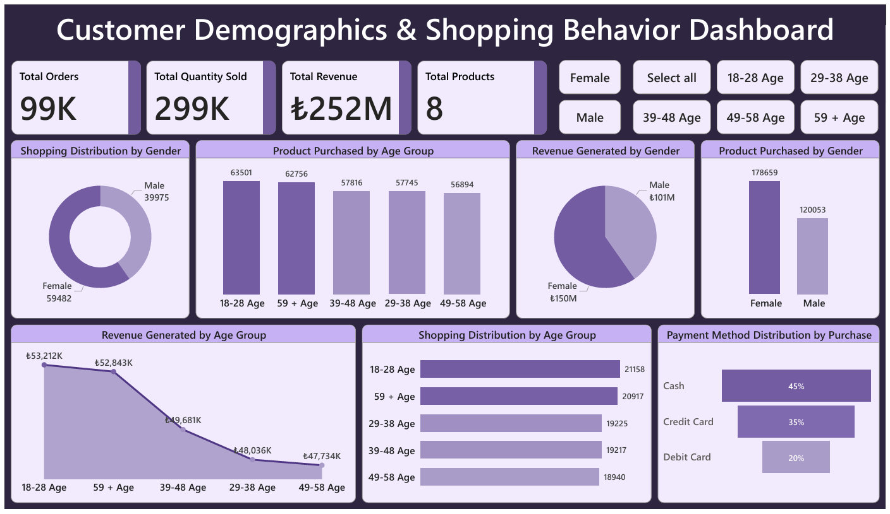
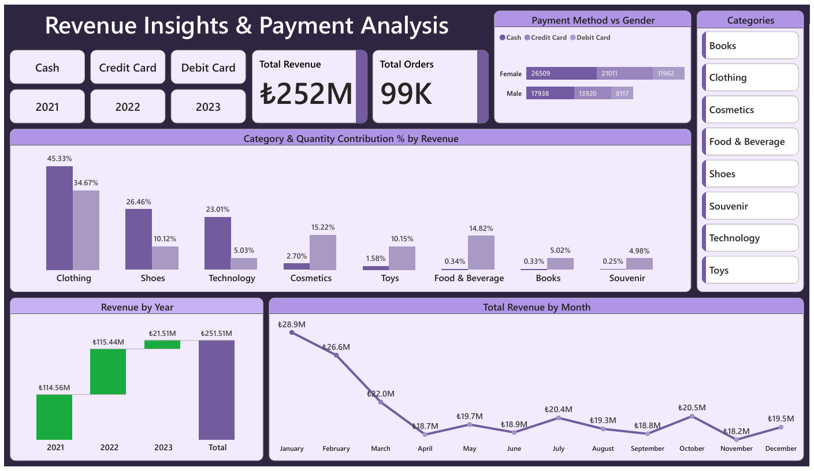

# Customer Data Analysis Dashboard 
**By Kirti Sundar Dey**  
📊 *Internship Project at  Rubixe – AI Solutions Company*

---

## 📝 Short Description  
A comprehensive **Power BI dashboard project** analyzing customer demographics, shopping behavior, revenue trends, and payment insights using data from 10 shopping malls (2021–2023).  
Data cleaning and preparation were performed using **MySQL Workbench**, followed by visualization in **Power BI**.

---

## 🏷️ Tags  
`#PowerBI` `#SQL` `#MySQLWorkbench` `#RetailAnalytics`  
`#CustomerDemographics` `#ShoppingBehavior` `#DataAnalysis`  
`#DashboardProject` `#PaymentAnalysis` `#DataVisualization`

---

## 📋 Project Overview  
This project provides insights into **customer shopping behavior** based on gender, age group, product categories, revenue contribution, and payment method distribution.

A raw dataset was provided containing information about invoices, customers, payment details, categories, quantities, prices, shopping malls, and dates.  
I extracted and cleaned this data using **MySQL Workbench**, then built an interactive **multi-page Power BI dashboard** to answer key business questions.

The project answers:

- How is shopping distributed by **gender**?  
- Which gender buys more products and generates more revenue?  
- How do different **age groups** behave in terms of shopping and spending?  
- Which **product categories** bring the highest revenue?  
- How do **payment methods** vary across demographics and years?  
- What are the **monthly and yearly revenue trends**?

---

## 🗂️ Project Workflow  

### **1. Data Extraction**  
- Loaded dataset into **MySQL Workbench**  
- Explored table structures and data fields  

📄 **Cleaned Data:** [`Data After Cleaning`](./CleanedData)

### **2. Data Cleaning (MySQL Workbench)**  
Performed:  
- Duplicate removal  
- Text standardization (gender, category, payment method)  
- Date formatting (`invoice_date`)  
- Grouping ages into categories  
- Checking missing values  
- Exported clean data into CSV  

📄 **SQL Script:** [`data_preparation.sql`](./DataPreparation/data_preparation.sql)

### **3. Dashboard Creation (Power BI)**  
- Two dashboards created:  
  - *Customer Demographics & Shopping Behavior*  
  - *Revenue Insights & Payment Analysis*  
- Added slicers: gender, age group, category, payment method, year  
- Used KPIs, bar charts, pie charts, line charts, funnel charts

---

## 📊 Dashboard Preview  

### **📌 Page 1 — Customer Demographics & Shopping Behavior**  
 

### **📌 Page 2 — Revenue Insights & Payment Analysis**  

---

## 🔍 Insights Summary  

### **1️⃣ Gender Insights**
- Female customers made **more purchases**  
- Female customers generated **₺150M revenue**, higher than males  
- Product quantity purchased is significantly higher among females  

### **2️⃣ Age Group Insights**
- **18–28 age group** buys the most products  
- Age 18–28 generates the **highest revenue**  
- 59+ age group also has high purchasing volume  

### **3️⃣ Category Insights**
Top revenue-contributing categories:  
- **Clothing – 45%**  
- **Shoes – 26%**  
- **Technology – 23%**

### **4️⃣ Payment Method Insights**
- **Cash (45%)** is the most used payment method  
- Credit Card accounts for **35%**  
- Debit Card accounts for **20%**  
- Female customers prefer **Credit Card** more than males  

### **5️⃣ Revenue Trends**
- Total revenue across years: **₺252M**  
- Revenue saw the biggest rise in **2022**  
- Highest monthly revenue: **January (₺28.9M)**  

---

## 🧩 Tools & Technologies  
| Tool | Purpose |
|------|---------|
| **MySQL Workbench** | Data extraction & cleaning |
| **SQL** | Data transformation |
| **Power BI** | Dashboard creation |
| **Excel / CSV** | Data export & inspection |

---

## 💡 Learnings  
- Applied SQL for data cleaning from raw structure → analysis-ready format  
- Built large-scale visual dashboards in Power BI  
- Understood customer behavior patterns & revenue drivers  
- Improved skills in data storytelling and reporting  

---

## 🚀 Future Improvements  
- Add **predictive modeling** for customer segmentation  
- Run **RFM Analysis** for customer lifetime value  
- Add mall-wise performance dashboards  
- Build automated ETL pipeline for real-time updates  

---

## 📧 Contact  
**👤 Kirti Sundar Dey**  
💼 Data Analyst | Power BI | SQL | Excel 
🎓 Internship Project by **Rubixe – AI Solutions Company**  
📍 Bengaluru, India  
🔗 [LinkedIn](https://www.linkedin.com/in/kirti-sundar-dey-0954122a5)
